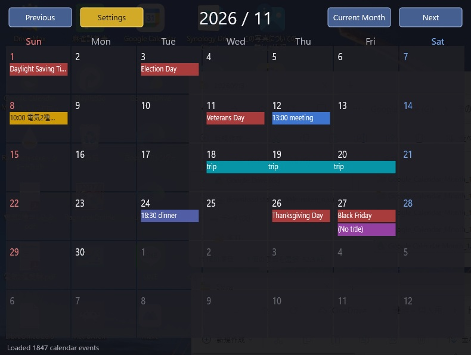

# Google Calendar Month for Rainmeter

A monthly Google Calendar skin for Rainmeter.  
Display Google Calendar events on your Windows desktop using iCal / ICS.

Googleカレンダーの予定をWindowsデスクトップに月間表示する  
Rainmeter用カレンダースキンです。

---

## Features

- Google Calendar iCal / ICS integration
- Monthly calendar view for Rainmeter
- Shared calendar support
- Holiday calendars
- Multilingual UI
- Voice announcements
- Configurable event colors
- Previous / Current / Next month navigation

## Download

Download the latest version from GitHub Releases:

https://github.com/kuroken2002/GoogleCalendarMonth-Rainmeter/releases

## Google Calendar Integration

This Rainmeter calendar skin uses the private iCal / ICS URL provided by Google Calendar.

You can display:

- Main Google Calendar
- Shared Google Calendar
- Holidays
- Recurring events
- Multi-day events

---

# Google カレンダー月間 for Rainmeter

Googleカレンダーの予定を月間表示するRainmeterスキンです。  
A Rainmeter skin that displays Google Calendar events in a monthly calendar view.

---

## 主な機能 / Features

### カレンダー表示 / Calendar

- Google Calendar の iCal / ICS URL に対応
- 月間カレンダー表示
- 前月 / 今月 / 来月へ移動
- 日曜・土曜を色分け
- 1日に表示する予定数を 1～3件から選択
- 予定数に合わせてカレンダーの高さを自動調整
- 予定ごとの背景色表示
- 複数日にまたがる予定を連続した帯で表示
- BYDAY を含む月次繰り返し予定に対応
- iCal 更新間隔を 1～60分で設定可能

### 共有カレンダー / Shared Calendar

- iCal URL を2つ登録可能
  - `[1]` メインカレンダー
  - `[2]` 共有カレンダー
- 共有カレンダーを1つ追加表示可能
- 共有カレンダーURLが空の場合は自動的に無視

### 祝日 / Holidays

- 祝日表示に対応
- 初期設定は ON
- 表示言語に合わせて祝日の国を自動選択
  - 日本語 → 日本
  - English → United States
  - Français → France
  - Deutsch → Germany

### 音声読み上げ / Speech

- 起動時に予定を読み上げ
- 今日 / 明日の予定を読み上げ
- 定時読み上げを2枠設定可能
- 読み上げ前に現在時刻を案内可能
- 予定が無い場合の読み上げに対応
- 判定間隔を設定可能
- テスト読み上げボタン

### 設定画面 / Settings

- タブ形式のコンパクトな設定画面
- 低解像度PCでも操作しやすいレイアウト
- 日本語 / English / Français / Deutsch に対応
- 選択中の設定をボタン色で表示
- 「保存して閉じる」ボタンを黄色で表示
- 長い iCal URL を確認しやすい入力欄

### 更新通知 / Update Notification

- GitHub の最新リリースを定期確認
- 新しいバージョンがある場合のみ通知
- 通知をクリックすると GitHub Releases を開く
- 自動更新は行いません

### 改良・派生について

このプロジェクトの解析・改良・派生開発は歓迎します。
バグ修正、改善、新しい機能などを作成した場合は、GitHub Issue、Pull Request、または Rainmeter Forum を通じて本家にも知らせてもらえると助かります。
派生版の作成も歓迎します。多くの利用者に役立つ改善であれば、本家への取り込みも検討します。

---

## Features

### Calendar

- Supports Google Calendar iCal / ICS URLs
- Monthly calendar view
- Previous / Current / Next month navigation
- Separate colors for Sundays and Saturdays
- Configurable number of events per day: 1, 2, or 3
- Calendar height automatically adjusts to the selected event count
- Optional event background colors
- Continuous bands for multi-day events
- Supports monthly recurring events including BYDAY rules
- Configurable iCal refresh interval from 1 to 60 minutes

### Shared Calendar

- Two iCal URLs can be registered
  - `[1]` Main calendar
  - `[2]` Shared calendar
- Supports one additional shared calendar
- Empty shared calendar URLs are ignored automatically

### Holidays

- Holiday calendar support
- Enabled by default
- Holiday country is selected automatically based on the display language
  - Japanese → Japan
  - English → United States
  - French → France
  - German → Germany

### Speech

- Read agenda at startup
- Read today's or tomorrow's schedule
- Two scheduled speech times
- Optional current time announcement before scheduled agenda
- Optional speech when there are no events
- Configurable check interval
- Speech test buttons

### Settings

- Compact tabbed settings screen
- Improved layout for lower-resolution displays
- Supports Japanese / English / French / German
- Selected settings are visually highlighted
- Yellow "Save and Close" button
- Larger iCal URL fields for easier editing

### Update Notification

- Periodically checks the latest GitHub release
- Notification is shown only when a newer version is available
- Clicking the notification opens GitHub Releases
- Updates are not installed automatically

### Contributions / 改良・派生について

You are welcome to study, modify, improve, and build upon this project.
If you create bug fixes, improvements, or useful new features based on this project, please let the original project know through a GitHub Issue, Pull Request, or the Rainmeter Forum.
Forks and derivative works are welcome. If your improvement may be useful to other users, I would be happy to consider bringing it back into the original project.

## 必要環境 / Requirements

- Windows 10 / 11
- Rainmeter 4.5 以降
- Internet connection
- Windows SAPI（音声読み上げ機能を使用する場合）

Rainmeter:

https://www.rainmeter.net/

---

## セットアップ / Setup

1. `.rmskin` をインストールします。
2. Google Calendar の設定から iCal URL を取得します。
3. Rainmeter の設定画面を開きます。
4. `[1]` にメインカレンダーの iCal URL を入力します。
5. 共有カレンダーを使う場合は `[2]` に共有カレンダーの iCal URL を入力します。
6. URL入力後、Enterキーで確定します。
7. 「保存して閉じる」を押します。

### Setup

1. Install the `.rmskin` package.
2. Get your iCal URL from Google Calendar.
3. Open the Rainmeter settings screen.
4. Enter the main calendar iCal URL in `[1]`.
5. If you use a shared calendar, enter its iCal URL in `[2]`.
6. Press Enter after entering each URL.
7. Click "Save and Close".

---

## iCal URLについて / About iCal URLs

Google Calendar の「非公開iCal」を使用します。

共有カレンダーを表示する場合も、Rainmeterからアクセス可能な iCal URL が必要です。

iCal URL には個人情報を含む場合があります。  
公開リポジトリやスクリーンショットには貼らないでください。

Use the "Secret address in iCal format" provided by Google Calendar.

Shared calendars also require an iCal URL that Rainmeter can access.

iCal URLs may contain private information.  
Do not publish them in repositories or screenshots.

---

## 対応言語 / Supported Languages

- 日本語 / Japanese
- English
- Français / French
- Deutsch / German

---

## バージョン / Version

Latest version: **v1.1.3**

### v1.1.3

- 共有カレンダー1件に対応
- iCal URLを2つ登録可能
- 日本 / アメリカ / フランス / ドイツの祝日表示
- 表示言語に応じた祝日の自動選択
- 更新通知機能
- iCal URL入力欄の改善
- 設定画面のレイアウト改善

### v1.1.2

- 多言語表示対応
- 1日の予定表示数を1～3件から選択可能
- 設定画面をタブ形式に変更
- 低解像度PC向けに設定画面を改善
- 空のiCal URL設定時に古いキャッシュを削除

---

## Download

GitHub Releases:

https://github.com/kuroken2002/GoogleCalendarMonth-Rainmeter/releases

Current release:

https://github.com/kuroken2002/GoogleCalendarMonth-Rainmeter/releases/tag/v1.1.3

---

## Rainmeter Forum

Google Calendar Month for Rainmeter:

https://forum.rainmeter.net/viewtopic.php?t=46019

---

## Privacy

このスキンは、設定された iCal URL からカレンダーデータを取得します。  
取得したデータはローカルで処理されます。

iCal URL には個人情報が含まれる場合があります。  
公開リポジトリ、フォーラム投稿、スクリーンショットなどに掲載しないでください。

This skin retrieves calendar data from the configured iCal URLs.  
Calendar data is processed locally.

iCal URLs may contain private information.  
Do not publish them in repositories, forum posts, or screenshots.

---

## Author

kuroken2002

GitHub:

https://github.com/kuroken2002/GoogleCalendarMonth-Rainmeter
